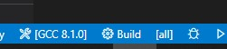
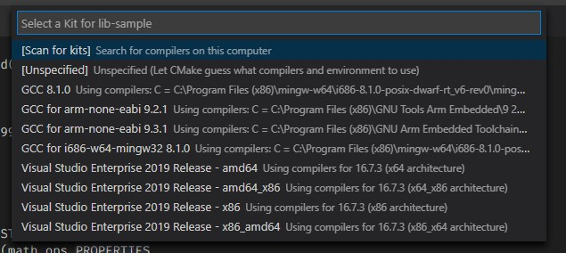
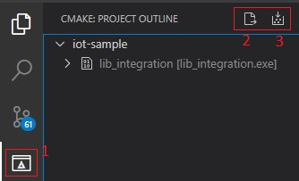

## C Static Library integration sample
This is a temp C Static library integration repo. 

### Pre-reqs
1. gcc
1. cmake

#### Optional
1. VS Code
1. C/C++ extension for VS Code
1. cmake extension for VS Code

### Platform
Windows

### Build Steps
* Clone
* Open with VS Code
* Select the compiler/kit by clicking at the bottom bar

   
   
   
   
* Select the cmake extension icon 

   

   * Click configure all projects
   * Click build all projects
